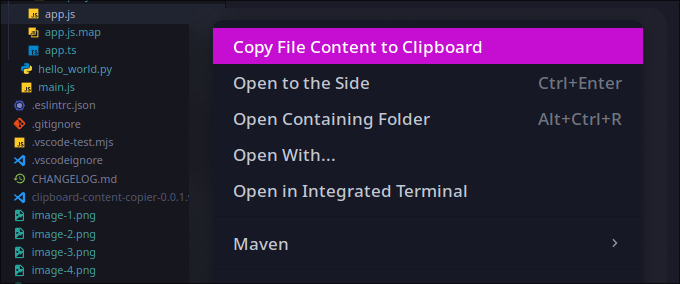
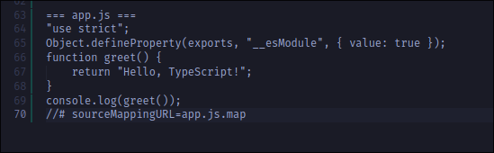
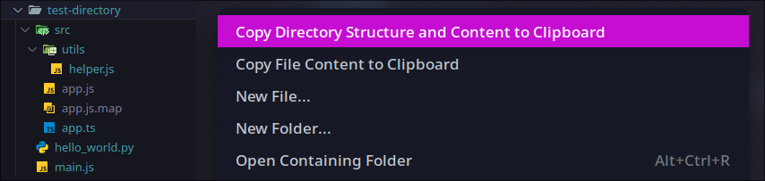
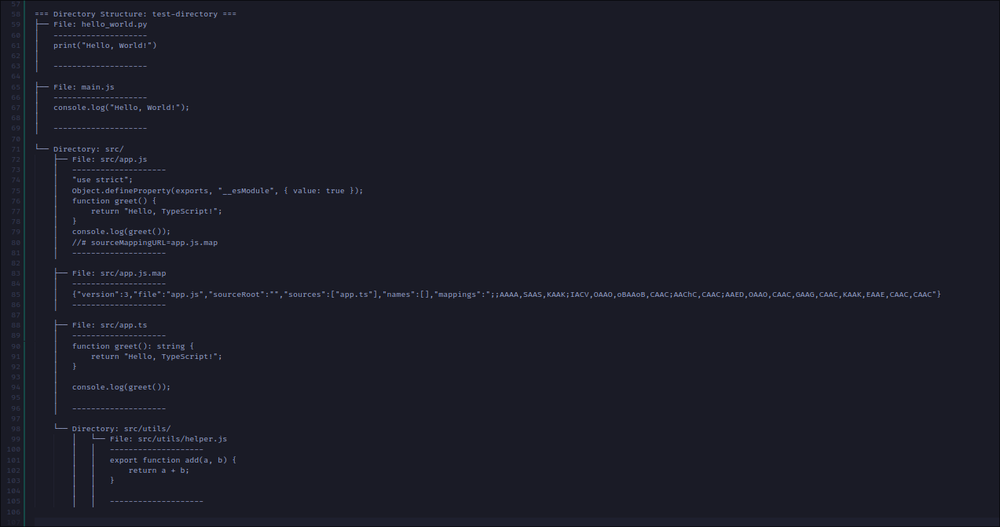

# Clipboard Content Copier - VS Code Extension

## Overview

The **Clipboard Content Copier** extension allows you to easily copy the names and contents of files and directories to your clipboard directly from Visual Studio Code. With simple commands, you can copy the entire content of a file or the structure and content of a directory, making it easier to share or document your work.

## Features

- **Copy File Content to Clipboard**: Copy the name and full content of a selected file to your clipboard.
- **Copy Directory Structure and Content to Clipboard**: Copy the directory structure along with the contents of all files within a selected directory.

## Usage

### Copy File Content

1. Right-click on any file in the Explorer view.
2. Select **Copy File Content to Clipboard**.
3. The file name and its content will be copied to your clipboard.

### Copy Directory Structure and Content

1. Right-click on any directory in the Explorer view.
2. Select **Copy Directory Structure and Content to Clipboard**.
3. The directory structure and the contents of each file within the directory will be copied to your clipboard.

## Installation

1. Open Visual Studio Code.
2. Go to the Extensions view by clicking on the Extensions icon in the Activity Bar on the side of the window.
3. Search for `Clipboard Content Copier`.
4. Click **Install**.

## Commands

- `clipboard-content-copier.copyFileContent`: Copies the name and content of the selected file to the clipboard.
- `clipboard-content-copier.copyDirectoryContent`: Copies the directory structure and content of the selected folder to the clipboard.

## Contributing

If you find any issues or have suggestions for new features, please feel free to [open an issue](https://github.com/Zhatra/clipboard-content-copier/issues) or submit a pull request.

## License

This project is licensed under the MIT License - see the [LICENSE](LICENSE) file for details.

---

**Enjoy using Clipboard Content Copier?** Please consider leaving a review on the [Visual Studio Code Marketplace](https://marketplace.visualstudio.com/items?itemName=Cryzto.clipboard-content-copier).
